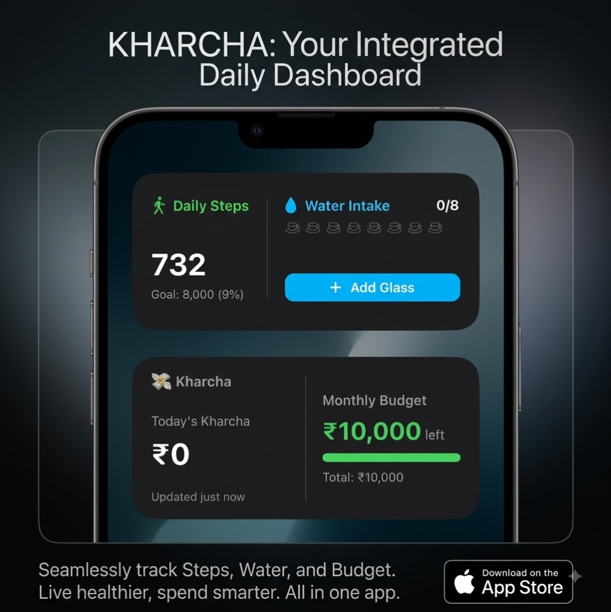
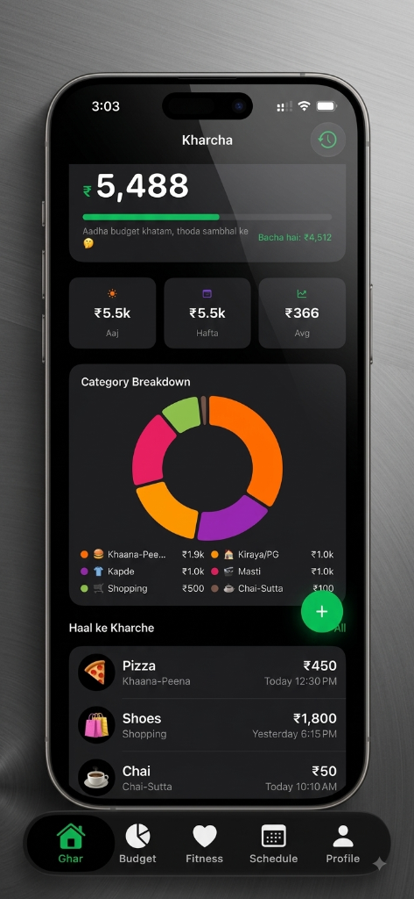
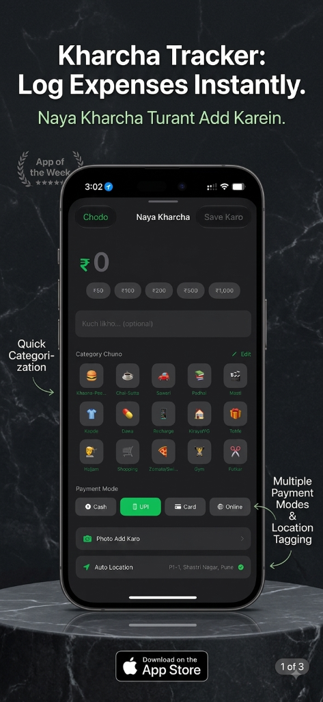
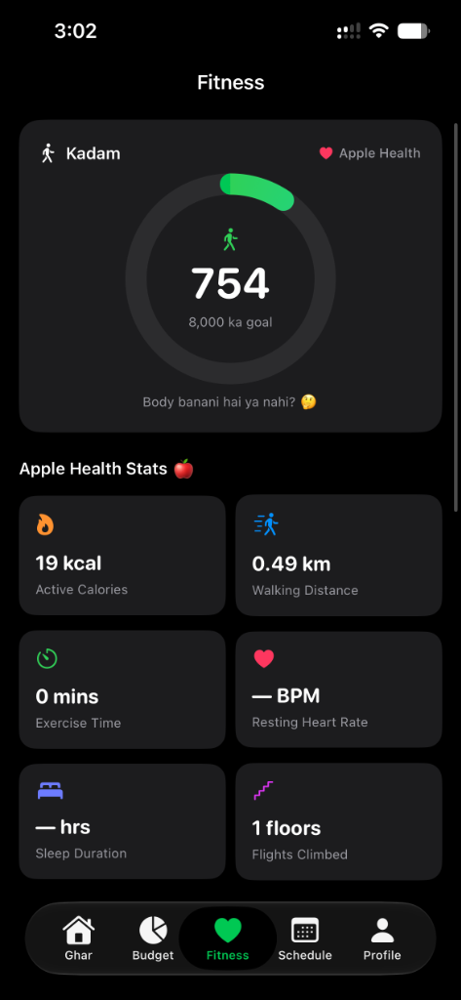
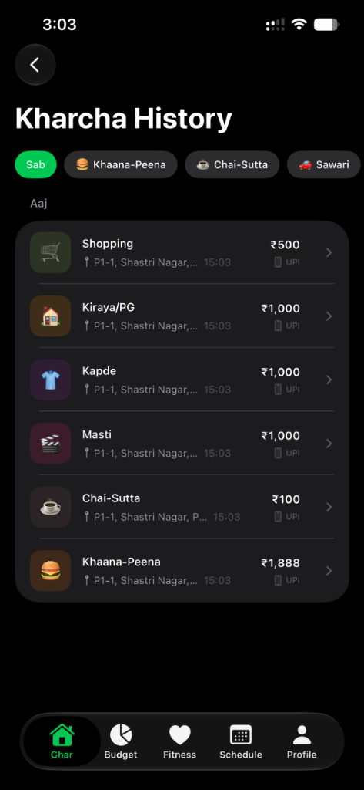

# Kharcha (खर्चा)

> A modern, privacy-first iOS companion for student expense tracking, Apple Health fitness, college scheduling, and interactive widgets.

[](https://github.com/D0pExD/Kharcha-APP/actions/workflows/ci.yml)
[](https://developer.apple.com/ios/)
[](https://swift.org)
[](https://developer.apple.com/xcode/swiftui/)
[](https://developer.apple.com/documentation/swiftdata)
[](LICENSE)

---

## Contents
- [App Preview](#app-preview)
- [Overview](#overview)
- [Features](#features)
- [Tech Stack](#tech-stack)
- [Getting Started](#getting-started)
- [Shortcuts Setup](#setting-up-ios-back-tap)
- [Privacy](#privacy-and-security)
- [License](#license)

## App Preview

<p align="center">
  
</p>

### In-App Experience

| Home and Analytics | Quick Add Expense | Apple Health Fitness | History and Geotags |
|:---:|:---:|:---:|:---:|
|  |  |  |  |

## Overview

Kharcha is designed for college students and young professionals to manage daily finances, monitor health metrics, and organize academic routines within a single native iOS application.

Built entirely with SwiftUI and SwiftData, Kharcha operates completely offline with zero telemetry, remote databases, or third-party trackers.

## Features

### Expense and Budget Tracking
- **Multi-Mode Logging**: Record transactions with support for UPI, Cash, and Card payment methods.
- **Budget Monitoring**: Set monthly spending limits with progressive visual indicators and threshold warnings when approaching limits.
- **Categorization and Analytics**: Interactive donut charts displaying spending breakdowns across customizable categories.
- **Receipt Attachments**: Capture and attach camera photos or gallery images directly to expense entries.

### Apple Shortcuts and Siri Integration
- **Back Tap Quick Logging**: Trigger expense entry via iOS Back Tap gestures without opening the application.
- **Dynamic Parameter Queries**: Uses AppIntents to fetch user categories directly from SwiftData in Siri prompts.
- **Structured Dialog Flow**: Sequential prompts for amount, category selection, optional notes, and receipt photo capture.

### Interactive Widgets
- **Spend and Budget Widget**: Displays daily expenditure and remaining monthly balance on Home Screen and Lock Screen.
- **Fitness and Hydration Widget**: Shows real-time step counts alongside interactive single-tap water intake logging.
- **App Group Bridge**: Shared data container ensuring immediate synchronization between the main app and widget extensions.

### Apple Health Integration
- **Activity and Steps**: Query daily step counts, 7-day trend visualizations, and active calorie expenditure using HealthKit.
- **Comprehensive Metrics**: Track walking/running distance, exercise minutes, resting heart rate, sleep duration, and flights climbed.
- **Workout and Water Tracking**: Log physical exercise sessions and daily hydration goals.

### GPS Location Tagging
- **Automatic Geocoding**: Tag transactions with latitude, longitude, and human-readable locality names via CoreLocation.
- **Map View**: Review expense locations on Apple Maps.

### Timetable and Academic Planner
- **Class Schedules**: Day-by-day course scheduling with room numbers, timings, and instructor details.
- **Task Tracker**: Manage assignments and exam dates with status tracking.

### Multilingual UI
- **Language Support**: Switch seamlessly between Hinglish, English, and Hindi.
- **Contextual Copy**: Natural localized strings and financial guidance tailored to everyday Indian student life.

### Offline Storage and Backup
- **Local Persistence**: All data is stored on-device using SwiftData models.
- **Data Portability**: Export and import complete unencrypted database backups in JSON and CSV formats.

## Tech Stack

| Layer | Technology |
|---|---|
| Language | Swift 5.9+ |
| User Interface | SwiftUI (iOS 17+ Design System) |
| Persistence | SwiftData (`@Model`, `@Query`) |
| Shortcuts and Siri | AppIntents (`AppIntent`, `AppEntity`, `EntityQuery`) |
| Widgets | WidgetKit and App Groups |
| Health and Fitness | HealthKit (`HKHealthStore`, `HKStatisticsQuery`) |
| Location | CoreLocation and MapKit |
| Unit Testing | XCTest |
| Project Generation | XcodeGen (`project.yml`) |

## Getting Started

### Prerequisites
- macOS Sonoma 14.0 or later
- Xcode 15.0 or later
- [XcodeGen](https://github.com/yonaskolb/XcodeGen)

```bash
brew install xcodegen
```

### Installation and Build

1. Clone the repository:
   ```bash
   git clone https://github.com/D0pExD/Kharcha-APP.git
   cd Kharcha-APP
   ```

2. Generate the Xcode project:
   ```bash
   xcodegen generate
   ```

3. Open and build in Xcode:
   ```bash
   open Kharcha.xcodeproj
   ```
   - Press `⌘ + R` to run on Simulator or a physical device.
   - Press `⌘ + U` to run the unit test suite.

## Setting Up iOS Back Tap

1. Open the **Shortcuts** app on iOS.
2. Create a new shortcut and add the **Log Kharcha** action.
3. *(Optional)* Add a menu prompt for camera receipt attachment using **Attach Receipt Photo**.
4. Navigate to **Settings ➔ Accessibility ➔ Touch ➔ Back Tap**.
5. Assign **Log Kharcha** to Double Tap or Triple Tap.

## Privacy and Security

Kharcha does not collect, transmit, or store any personal data remotely. Read the complete [Privacy Policy](PRIVACY.md) for details on device permissions.

---

## License

This project is licensed under the MIT License. See the [LICENSE](LICENSE) file for details.

## Author

**Ram**
